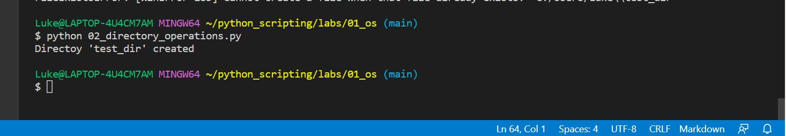
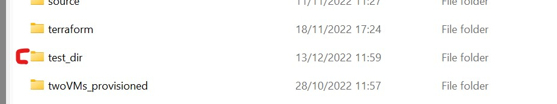
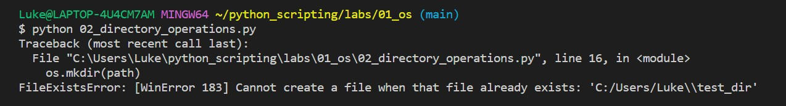
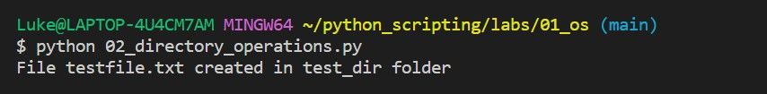
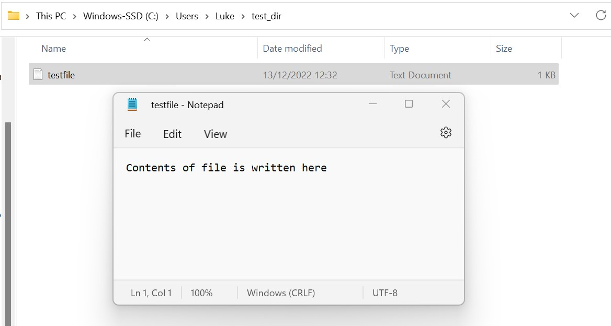

# Python scripting

## Timings

10 minutes

## This lesson includes

* How we can use the os module
* Automating directory operations
* Automated shell scripts

## Basic use of os module

Let's quickly review are simple use of the os module.

```
import os
# prints hello in the terminal
os.system('echo "Hello World!"')
```

If we run this file, what does it do? Of course it outputs:

```
`Hello World!`
```

In your terminal.

The point is, we can run this 100 times and never have to actually write "Hello World! more than the one time we write it in the .py file.

## Using os module to manipulate directories

Let's create a script that can create a new direcctory. We need `os` of course. I have also imported `shutil`, which allows for some more complex directory options.

```
import os

# 1. Create Directory

# Directory
directory = "test_dir"

# Path to parent dir
parent_dir = "C:/Users/Luke"

# Path
path = os.path.join(parent_dir, directory)

# Create the DIR
os.mkdir(path)
print ("Directoy '% s' created"  % directory)
```
Walkthrough:

- First we create a variable called test_dir
- Now we create a second variable to store the path we want to create the directory within (parent_dir)
- At this point, we can specify a third variable called path. It contains the parent_dir and directory variables.
- Heres the important bit. We call `os.mkdir`(path), mkdir stands for 'make directory'. By giving it the path variable as it's arguement, Python will create a directory with the name 'test_dir' within the 'C:/Users/Luke' directroy.
- Finally, lets add a print statement to confirm if the script is successfull.

In action:

When we run the file, Python makes the directory for us. When then get the successful print message to confirm.



Lets check the correct parent directory:



What about if we run the program again?



We get an error because test_dir already exists in that parent directory. If we delete it and run the script again it will work. We could also rename the folder within the script, or enter a different parent dir.

## Putting a file in this new directory

So how to we add a file to a directory? The same way right? Well no, but we do still use the os module.

First we want to make some variables to hold out filename and where we want the file to go.
We use the path variable from the previous code block to get the right location.

```
filename = "testfile.txt"
filepath = os.path.join(path, filename)
```

From here, we simply need to use the os.path method to send the file tothe right directory. You can state a directory manuallly, but lets use the variable we created:

```
with open(os.path.join(path, filename), "w") as file1:
    toFile = "Contents of file is written here"
    file1.write(toFile)
print("File " + filename + " created in " + directory + " folder")
```

note the toFile variable. This is simply the contents of the file. So if we want to save code we can easily do so here. Just change the contents of the toFile variable.

Now we have this code, when we run the file a text file called 'testfile.txt' is created in the test_dir directory.



Here it is in the gui. When we open it, the contents are there.



## Shell execution via Python script

AS DevOps engineers, we will be usinng the terminal A LOT. Everyday realistically. Some processes we undertake in the terminal can be automated. Let's understand how to interact with the terminal with a Python script.

Create a new python file. In order to work with the terminal (shell), we need os and subprocess.

```
import os
import subprocess
```

We don't actually give the commands to be run within our Python sccript. Instead we need to make a .sh file that holds them. Let's do that now. Create a folder called 'files' and inside it make a file named `script.sh`. Open this file.

The .sh file needs to know it is using bash (in the same way we open GitBash to run commands). At the top of the file add this line:

```
#! /bin/bash
```

The `#!` is important! Don't neglect it.

Now let's add a simple shell command to complete, so we can verify our script works.

```
echo "This is a shell script"

ls # outputs contents of current working directory
```

Save the file and return to yourr .py file. In there, lets add these lines:

```
script_dir = os.path.dirname(__file__)

script_abosulte_path = os.path.join( script_dir + "/files/script.sh")

subprocess.call(['sh', script_abosulte_path])
```

These three lines are simple. 

1. The first stores the path of the current file.
2. The second stores the absolute path to the shell file we want to run
3. The third line calls the shell file and runs it.

This means that we can now execute reptitive commands all at once with a .sh file.

>Task: Can you give params to the shell file and get it to use these params in your commands?

## Summary

You just:

* Learned to use os module to run commands.
* Learned to use os to make directories and files.
* Learned how to run shell files with Python.
