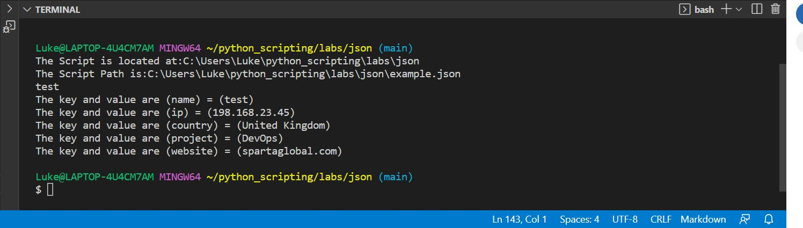
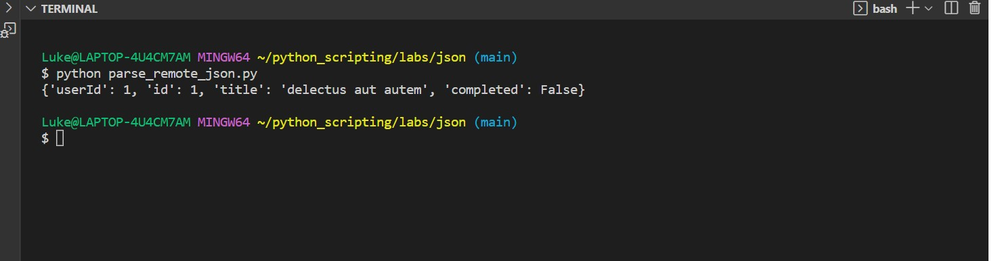

# Parsing JSON using Python scripts

## Timings

30-60 mins

## The scenario

This is an extremely common task for DevOps engineers in the workplace. JSON is of course a format for storing and transporting data. It is 'self describing' easy to understand. The vast majority of languages can interperet it. An example of where it is used, is when a server sends data to a web-page.

## Understanding JSON

Let's understand what we are working wit, before we being to automate. JSON uses key-value pairs (in JSON they are known as 'name-value pairs')  for it's notation. The name/value pair consists of a field name (in double quotes), followed by a colon, followed by a value:

```
"firstname":"John"
```

JSON names require double quotes.

**We can create objects in JSON by writing them inside curly braces**
 
 ```
 {firstName":"John", "lastName":"Doe"}
 ```

 **JSON Arrays**

 Here is an example of an array in JSON called employees:

 ```
"employees":[
    {"firstName":"John", "lastName":"Doe"},
    {"firstName":"Anna", "lastName":"Smith"},
    {"firstName":"Peter", "lastName":"Jones"}
]
 ```

In this example, the array 'employees' has three objects, each of which being a separate person.

## Back to Python

So now we know how JSON works. Lets get to parsing it with Python scripts.

Parsing is converting a string into a data strucutre, as long as the source text matches what the parser is expeccting, it will output that data in a dat format we can use.When we are asked to parse a JSON file we could either be asked to:

1. Read the JSON file from the path, parse it and print a specific value from it.

or

2. Get a JSON file from a remote URL and parse it

We will be usnig the following JSON for this lesson:

```
{
    "name" : "test",
    "ip" : "198.168.23.45",
    "country" : "United Kingdom",
    "project" : "DevOps",
    "website" : "spartaglobal.com"
}
```

## Create a file called parse_json.py

In there add the following code:

```
import json
json = json.loads(open('/path/to/file.json').read())
value = json['key']
print (json['value'])
```

Lets step through it.

```
import json
```

This is to import the JSON module, with this we can now make scripts that interact with JSON.

```
json = json.loads(open('/path/to/file.json').read())
value = json['key']
print json['value']
```

This code block looks to get a value from the JSON file via a keyword. So in this case, lets change the value to 'country'.

```
value = json['country']
```

So if we run this file:

```
import json
json = json.loads(open('C:/Users/Luke/python_scripting/labs/json/example.json').read())
value = json['country']

print (value)
```

The output is:


## More advanced

Let's see if you can print all of the keys and values from our JSON file, using Python
(15 minute task to print out all the keys and values together)

**Solution code**

```
import json
import os

# Script to create absolute path of the JSON file.

script_dir = os.path.dirname(__file__)
print("The Script is located at:" + script_dir )
script_absolute_path = os.path.join(script_dir, 'example.json')
print("The Script Path is:" + script_absolute_path)

# Script to parse JSON

json = json.loads(open(script_absolute_path).read())
value = json['name']
print(value)

# Loop through JSON keys and values

for key in json:
    value = json[key]
    print("The key and value are ({}) = ({})".format(key, value))
```

The output:



## Parse JSON from a remote URL (API Request)

The steps to do this are quite different, but as we are scripting they are still relatively straightforward.

In this scenario, we need to parse data we have been sent from a remote server via an API call. To do this we once again need the JSON module, but also a module to deal with the url. For python 3+ it is `urllib3`. We specifically need the .request method in urllib3 so lets import that.

Here is the sample code to do this, lets step through it:

```
import urllib.request
import json 
with urllib.request.urlopen("http://jsonplaceholder.typicode.com/todos/1") as url:
    data = json.load(url)
    print(data)
```

Here we first import the libraries we need. Next we use urllib3.requests to get the JSON data from the url. Then we store that data in a variable (called data), we need to use json.load to parse it properly. And in this case we simply print the data out. So the output is:



## Looping through parsed JSON

Finally lets look at how to loop through some JSON that we have parsed.
(Optionally, this can be given as an independant task for 15 mins).

Here is the full code:

```
import json
import os

script_dir = os.path.dirname(__file__)
print("The Script is located at:" + script_dir )
script_absolute_path = os.path.join(script_dir, 'example.json')
print("The Script Path is:" + script_absolute_path)


json = json.loads(open(script_absolute_path).read())
value = json['name']
print(value)

# print the keys and values
for key in json:
    value = json[key]
    print("The key and value are ({}) = ({})".format(key, value))
```

All we really did was add the code for a loop. We needed a json objecct in order to hold the json content for the loop:

```
# print the keys and values
for key in json:
    value = json[key]
    print("The key and value are ({}) = ({})".format(key, value))
```

So now we can see how Python scripting allows us to parse JSON efffectively and quickly using scripts.

# Further labs:

* [Use Python scripts to validate json](https://github.com/LSF970/python_scripting/tree/main/labs/02_json/check_json)
* [Use Python scripts to transform JSON into YAML with one command](https://github.com/LSF970/python_scripting/tree/main/labs/02_json/json2yaml)